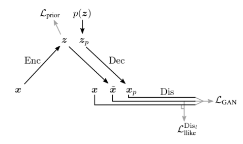
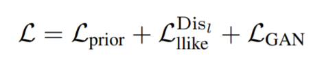
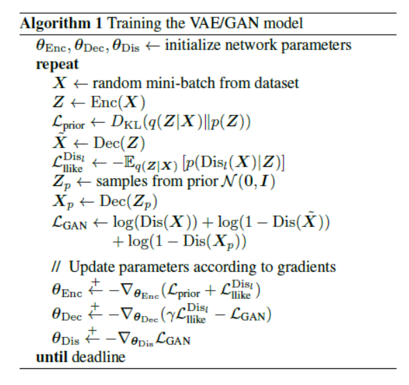
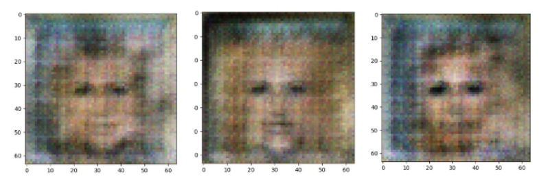

# VAEGAN
Autoencoding beyond pixels using a learned similarity metric

For this project, we are going to rebuild the model specified in the paper of Larsen et. al. (2016). (https://arxiv.org/pdf/1512.09300.pdf)

## Overview

  In this method, a variational autoencoder (VAE) is combined with a Generative Adversarial Network (GAN) in order to learn a higher level image similarity metric instead of the traditional element-wise metric. The model is shown in Fig.1.

*Fig.1 VAE-GAN Network Overview*

  The encoder encodes the data sample $x$ into a latent representation $z$ while the decoder tries to reconstruct $x$ from the latent vector. This reconstruction is fed to the discriminator of the GAN in order to learn the higher-level sample similarity. 

  The VAE and GAN is trained simultaneously using the loss function in Equation 1 which is composed of the prior regularization term from the encoder, the reconstruction error, and the style error from the GAN. However, this combined loss function is not applied on the entire network. Alg.1 shows the algorithm used in training the VAE/GAN network.
 
 

*Equation 1. Combined loss function*

*Algorithm 1. VAE/GAN Network Algorithm*

## Minor change from the paper

  The model trains the discriminator more often than the generator, which according to some papers, will yield better results.

## Results

  We were able to generate faces from the noise. Some facial features like the eyes, nose, lips, and chin are easily distinguishable. However, the generated faces appears blurry and noisy, one of the possible causes might be in the encoder model and the lack of training time.
	

## Usage:

**For training the model**

* python3 VAEGAN.py

**For testing**

* python3 VAEGANtest.py

